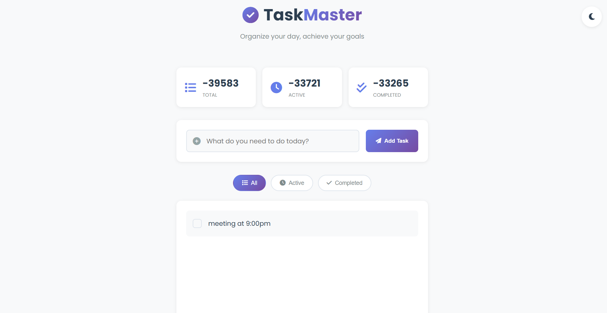
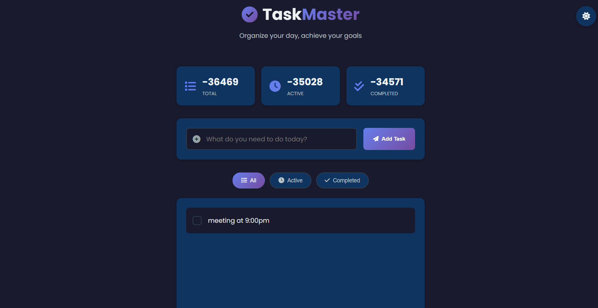

# TaskMaster - Todo List Application ✅

<div align="center">



[](https://rajatsharma0087.github.io/todo-app/)
[](https://github.com/Rajatsharma0087/todo-app)
[](https://developer.mozilla.org/en-US/docs/Web/HTML)
[](https://developer.mozilla.org/en-US/docs/Web/CSS)
[](https://developer.mozilla.org/en-US/docs/Web/JavaScript)

**A modern, feature-rich todo application built with pure HTML, CSS & JavaScript.**
**Zero frameworks. Zero dependencies. Just clean code.**

[View Live Demo](https://rajatsharma0087.github.io/todo-app/) · 
[Report Bug](https://github.com/Rajatsharma0087/todo-app/issues) · 
[Request Feature](https://github.com/Rajatsharma0087/todo-app/issues)

</div>

---

## 📸 Preview

| Light Mode | Dark Mode |
|------------|-----------|
|  |  |

---

## ✨ Features

### Core Features
- ✅ **Add Tasks** — Quickly add tasks with a clean input form
- ✅ **Complete Tasks** — Mark tasks as done with smooth checkbox animation
- ✅ **Edit Tasks** — Update any task via a clean modal popup
- ✅ **Delete Tasks** — Remove individual tasks with confirmation
- ✅ **Filter Tasks** — View All / Active / Completed tasks separately

### Advanced Features
- 🌙 **Dark / Light Mode** — Toggle with persistence via localStorage
- 💾 **Local Storage** — Tasks survive page refresh and browser close
- 📊 **Live Stats** — Animated counters showing Total / Active / Completed
- 🔔 **Toast Notifications** — Real-time feedback for every action
- 🗑️ **Bulk Actions** — Clear completed tasks or all tasks at once
- 📱 **Fully Responsive** — Works perfectly on mobile, tablet, desktop
- ⌨️ **Keyboard Shortcuts** — Power user features built in
- 🎨 **Smooth Animations** — Slide-in tasks, modal animations, heartbeat footer

---

## ⌨️ Keyboard Shortcuts

| Shortcut | Action |
|----------|--------|
| `Ctrl + K` | Focus on task input |
| `Ctrl + Shift + D` | Toggle dark/light mode |
| `Escape` | Close edit modal |
| `Enter` | Submit new task |

---

## 🛠️ Built With

| Technology | Purpose |
|------------|---------|
| HTML5 | Structure and semantic markup |
| CSS3 | Styling, animations, CSS variables |
| Vanilla JavaScript | Logic, DOM manipulation, localStorage |
| Font Awesome 6 | Icons throughout the UI |
| Google Fonts (Poppins) | Typography |

**No frameworks. No libraries. No npm. No build tools.**
**Open index.html and it just works.**

---

## 📁 Project Structure

```
todo-app/
│
├── index.html      # Main HTML structure
├── style.css       # All styles + dark theme + animations
├── script.js       # Complete app logic
└── README.md       # You are here
```

---

## 🚀 Quick Start

### Option 1: View Live
Click here → [rajatsharma0087.github.io/todo-app/](https://rajatsharma0087.github.io/todo-app/)

### Option 2: Run Locally

```bash
# Step 1: Clone the repository
git clone https://github.com/Rajatsharma0087/todo-app.git

# Step 2: Navigate to folder
cd todo-app

# Step 3: Open in browser
# Simply open index.html in any browser
# No installation needed. No npm install. Nothing.
```

### Option 3: Download ZIP
1. Click the green **Code** button above
2. Select **Download ZIP**
3. Extract the folder
4. Open `index.html` in your browser

---

## 💡 Key Learnings

Building this project taught me:

**JavaScript Concepts:**
- DOM manipulation and dynamic element creation
- localStorage for data persistence across sessions
- Event delegation and event listeners
- Array methods (map, filter, find, unshift)
- Spread operator for immutable state updates
- Template literals for dynamic HTML generation
- XSS prevention using escapeHtml utility function

**CSS Concepts:**
- CSS custom properties (variables) for theming
- CSS animations (@keyframes for slideIn, heartbeat, modalSlideIn)
- Flexbox and CSS Grid for responsive layouts
- Smooth transitions for interactive elements
- Mobile-first responsive design with media queries
- Glassmorphism and modern UI patterns

**Best Practices:**
- Separating concerns (HTML structure, CSS styling, JS logic)
- Writing reusable functions
- User feedback through toast notifications
- Accessibility with aria-labels
- Clean, commented, maintainable code

---

## 🔮 Future Improvements

- [ ] Drag and drop to reorder tasks (code already prepared, commented out)
- [ ] Task priority levels (High / Medium / Low)
- [ ] Due dates and reminders
- [ ] Categories / tags for tasks
- [ ] Search functionality
- [ ] Export tasks as PDF or CSV
- [ ] Sync across devices with backend

---

## 📊 What This Project Demonstrates

```
For potential clients reading this:

This todo app shows I can build:
✅ Interactive UIs without any framework
✅ Data persistence without a database
✅ Responsive designs that work on all devices
✅ Clean, maintainable code structure
✅ Thoughtful UX (confirmations, notifications, keyboard support)

If I can build this with zero dependencies,
imagine what I can build for your business.
```

---

## 🤝 Connect With Me

| Platform | Link |
|----------|------|
| 🐦 Twitter/X | [@Rajatsharma_87](https://twitter.com/Rajatsharma_87) |
| 💼 Portfolio | [rajatsharma0087.github.io/-personal-portfolio/](https://rajatsharma0087.github.io/-personal-portfolio/) |
| 🐙 GitHub | [github.com/Rajatsharma0087](https://github.com/Rajatsharma0087) |
| 📧 Hire Me | DM on Twitter for freelance work |

---

## 📄 License

This project is open source and available under the 
[MIT License](LICENSE).

Feel free to use this as a reference or template.
A ⭐ star on the repo is appreciated if this helped you!

---

<div align="center">

**Made with ❤️ by [Rajat Sharma](https://rajatsharma0087.github.io/-personal-portfolio/)**

*Open for freelance web development projects*
*Starting at ₹3,000 / $50*

</div>
